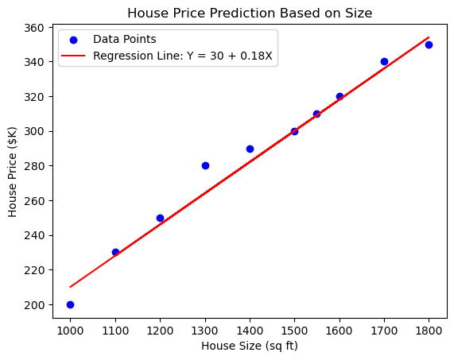

# 1. **Definition of Regression in Machine Learning**

In the realm of machine learning, `regression` is a statistical technique used for predicting real-valued outcomes. It's a foundational concept for those aspiring to become machine learning engineers, as it lays the groundwork for understanding how algorithms can predict and interpret continuous data.

**Regression models** stand out for their ability to `produce continuous or quantitative outputs`, making them ideal for problems where precision in prediction is key. This contrasts with classification models, which are designed to predict discrete categories or classes. While classification might determine whether a tumor is malignant or benign, regression would be used to predict something like the expected growth rate of the tumor.

Essentially, regression deals with the `'how much'` or `'how many'` questions in predictive modeling, providing nuanced insights that guide decision-making in fields ranging from finance to healthcare. By understanding and leveraging the unique strengths of regression, machine learning engineers can create powerful predictive tools that capture the subtleties and complexities of real-world data.

## 1.1. Exploring the Essence of Regression

### Core Concept
Regression analysis in machine learning is a method for quantifying the relationship between a dependent (target) variable and one or more independent (predictor) variables. The relationship is typically expressed by a regression equation:

$$\
ŷ = β_0 + β_1X_1 + β_2X_2 + ... + β_nX_n + ε
\$$

In this equation:
- `ŷ` (y-hat) is the predicted value of the dependent variable `Y`.
- `X₁, X₂, ..., Xₙ` are the independent variables or predictors.
- `β_0` is the intercept of the regression line.
- `β_1` to `β_n` are the coefficients, representing the impact of each independent variable on `Y`.
- `ε` represents the error term, the difference between the predicted values and actual values.

`Example 1`

To demonstrate regression analysis for predicting the price of a house based on its size, let's start by creating a simple dataset with 10 entries. We'll use house size (in square feet) as the independent variable `X` and house price (in thousands of dollars) as the dependent variable `Y`. 

Here's a hypothetical dataset:

| House Size (sq ft) `X` | House Price ($K) `Y` |
|------------------------|----------------------|
| 1000                   | 200                  |
| 1500                   | 300                  |
| 1200                   | 250                  |
| 1800                   | 350                  |
| 1300                   | 280                  |
| 1600                   | 320                  |
| 1100                   | 230                  |
| 1550                   | 310                  |
| 1700                   | 340                  |
| 1400                   | 290                  |

Now, let's assume a simple linear regression model for this data. The linear regression equation can be represented as:

$$
Y = β_0 + β_1X
$$

Where:
- `Y` is the house price (in thousands of dollars).
- `X` is the house size (in square feet).
- `β_0` is the y-intercept of the regression line.
- `β_1` is the slope of the regression line.

After analysis, suppose we find:
- `β_0` (intercept) = 30
- `β_1` (slope) = 0.18

The regression equation would then be:

$$
Y = 30 + 0.18X
$$

This means for each additional square foot, the house price increases by $180 (since the price is in thousands of dollars).

The plot above illustrates the linear regression model for our house price prediction based on size. The blue dots represent the actual data points from our dataset, showing the known house sizes and their corresponding prices. The red line is the regression line given by the equation `Y = 30 + 0.18X`, which represents our predictive model.

The regression line is the result of finding the best fit through the data points that minimizes the overall distance between the line and each of the points. Here's what each part of the line represents:

- The y-intercept (`β_0 = 30`) is where the line crosses the Y-axis. This represents the starting price value when the size of the house is zero. It's a theoretical construct since there's no house with zero size, but it helps anchor our line within the context of the data.
- The slope of the line (`β_1 = 0.18`) indicates the rate of increase in the house price for each additional square foot. The slope shows a fairly steady increase in price with size, which is typical for property values.

This linear model provides a simple yet powerful tool for predicting house prices. By inputting the size of a house into our equation, we can quickly estimate its price. For instance, if we wanted to predict the price of a house that is 2000 square feet, we would calculate it as `Y = 30 + 0.18 * 2000`, giving us a predicted price of $390K.

Understanding this plot and the regression equation can help potential buyers or real estate analysts make informed decisions based on the size of a property.

Note: In real-world scenarios, deriving these coefficients (`β_0` and `β_1`) involves more complex statistical analysis and the consideration of more variables for accuracy.

### Objective
The main goal of regression is to accurately predict the dependent variable `Y` using the independent variables. This is achieved by finding the best-fit values for the coefficients `β_1` to `β_n` that minimize the error term `ε`, thus ensuring that the predictions are as close as possible to the actual outcomes.

### Real-World Analogy
Consider predicting a household's daily energy consumption. The actual consumption (`Y`) is estimated based on variables such as the number of residents (`X₁`), season (`X₂`), and average daily temperature (`X₃`). The regression model analyzes historical data to provide predicted values (`ŷ`) for how these factors influence energy usage.

### Note on Notation in Python
In Python coding, especially with libraries like Pandas and scikit-learn, it's common to use variable names like `y_pred` or `y_predicted` to store the predicted values from a regression model. This notation aligns with the mathematical `ŷ`, ensuring code clarity and readability.

## 1.2. Varieties of Regression Models
Each type of regression model has its unique characteristics and use cases:

### a) Linear Regression:
This is the starting point for many. It predicts a linear relationship between the dependent and independent variables.
    
### b) Multiple Linear Regression:
An extension of linear regression where multiple independent variables are used to predict the dependent variable.

### c) Polynomial Regression:
Useful for modeling non-linear relationships. It fits a polynomial line to the data points.

### d) Logistic Regression:
Despite the name, it’s used for `classification problems`. It predicts the probability of an outcome that can be either 0 or 1.

### e) Ridge and Lasso Regression:
These are variations of linear regression that include regularization to avoid overfitting.

## 1.3 - Why Regression Models are Crucial

Understanding the applications of regression models is key to grasping their significance:
   
### Forecasting and Predictive Analysis
> Widely used in business for sales forecasting, risk management in finance, and demand estimation in economics.

### Medical Field
> In healthcare, it's used for predicting patient outcomes and disease progression.

### Engineering
> Utilized in predictive maintenance and optimization of systems.

### AI Development
> Forms the basis of many predictive algorithms in machine learning and artificial intelligence.
