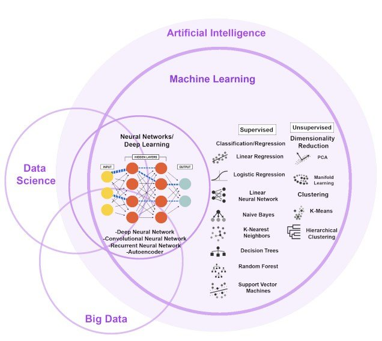

# Introduction to Machine Learning

## 1. Overview of Machine Learning

### 1.1 Understanding AI, Machine Learning, and Deep Learning

    

**a. Artificial Intelligence (AI)**

AI is the overarching discipline that encompasses the creation of intelligent machines capable of performing tasks that typically require human intellect.

> Example: An intelligent home automation system that adapts the home environment to the preferences of its residents without manual programming.

**b. Machine Learning (ML)**

ML is a branch of AI focused on algorithms that enable machines to improve at tasks with experience.

> Example: A fraud detection system that learns to identify fraudulent transactions by analyzing patterns in transaction data.

**c. Deep Learning (DL)**

DL, a subset of ML, leverages multi-layered neural networks to analyze data, allowing for the modeling of complex patterns.

> Example: Facial recognition technology used in security systems that can accurately identify individuals even in varying lighting conditions.

---

### 1.2 Technologies, Languages, and Libraries in Machine Learning

#### 1.2.1 Programming Languages

- **Python**
  
  > A versatile language with extensive support for ML through numerous libraries and frameworks.

- **R**
  
  > Focused on statistical analysis and visualization, R is particularly strong in academia and research settings.

#### 1.2.2 Key Libraries and Frameworks

- **NumPy & Pandas**
  
  > Essential Python libraries for numerical computing and data manipulation.

- **scikit-learn**
  
  > A comprehensive library providing simple and efficient tools for predictive data analysis.

- **TensorFlow & PyTorch**
  
  > Leading frameworks for building and training deep learning models with GPU acceleration.

- **Keras**
  
  > High-level neural networks API, written in Python and capable of running on top of TensorFlow.

- **Matplotlib & Seaborn**
  
  > Widely used Python libraries for creating static, interactive, and informative visualizations.

---

### 1.3 When to Use Machine Learning and Deep Learning

While traditional programming is effective for problems with clear rules and logic, machine learning and deep learning shine when such rules are hard to define.

- **Use `Traditional Programming` when:**
  
  > - The problem is well-understood and can be solved with explicit rules.
  > - Data is scarce or not available.
  > - The environment is static, and change is infrequent.
  > - You require 100% interpretability of the model's decisions.

- **Use `Machine Learning` when:**
  
  > - The problem involves complex patterns that are difficult for humans to articulate.
  > - There is an abundance of data available for training.
  > - The task involves making predictions or classifications based on past data.
  > - Adaptability is required as the model needs to evolve with data over time.

- **Use `Deep Learning` when:**
  
  > - The task involves interpreting highly complex and high-dimensional data, such as images, audio, and text.
  > - You have the computational resources to train large neural networks.
  > - You can leverage large labeled datasets for supervised training, or significant amounts of data for unsupervised learning.

The choice between these approaches depends not only on the nature of the problem and data but also on the available computational resources and the required transparency of the model's decisions.

---

## 2. Supervised Learning

### 2.1 What is Supervised Learning?

**Supervised learning**, also known as `supervised machine learning`, is a subcategory of machine learning and artificial intelligence.

**`It is defined by its use of labeled datasets to train algorithms that to classify data or predict outcomes accurately.`**

As input data is fed into the model, it adjusts its weights until the model has been fitted appropriately, which occurs as part of the cross validation process. 

**<u>Supervised learning helps organizations solve for a variety of real-world problems at scale, such as classifying spam in a separate folder from your inbox.</u>**

### 2.2 How Supervised Learning Works

Supervised learning uses a training set to teach models to yield the desired output. This training dataset includes inputs and correct outputs, which allow the model to learn over time.

The algorithm measures its accuracy through the `loss function`, adjusting until the error has been sufficiently minimized.

Supervised learning can be separated into two types of problems when data mining:

1. <u>**Classification**</u>
   
   It uses an algorithm to accurately assign test data into specific categories. It recognizes specific entities within the dataset and attempts to draw some conclusions on how those entities should be labeled or defined.
   
   **Common classification algorithms are linear classifiers, support vector machines (SVM), decision trees, k-nearest neighbor, and random forest, which are described in more detail below.**

2. <u>**Regression**</u>
   
   Regression is used to understand the relationship between dependent and independent variables. It is commonly used to make projections, such as for sales revenue for a given business.
   
   **Linear regression, logistical regression, and polynomial regression are popular regression algorithms**.

### 2.3 Key Algorithms in Supervised Learning

Various algorithms and computations techniques are used in supervised machine learning processes. Below are brief explanations of some of the most commonly used learning methods, typically calculated through use of programs like R or Python:

#### **<u>Neural Networks</u>**

Primarily leveraged for deep learning algorithms, neural networks process training data by mimicking the interconnectivity of the human brain through layers of nodes. Each node is made up of inputs, weights, a bias (or threshold), and an output. If that output value exceeds a given threshold, it “fires” or activates the node, passing data to the next layer in the network.

Neural networks learn this mapping function through supervised learning, adjusting based on the loss function through the process of gradient descent. <u>**When the cost function is at or near zero, we can be confident in the model’s accuracy to yield the correct answer**</u>.

#### **<u>Naive Bayes</u>**

Naive Bayes is classification approach that adopts the principle of class conditional independence from the Bayes Theorem. This means that the presence of one feature does not impact the presence of another in the probability of a given outcome, and each predictor has an equal effect on that result.

There are three types of Naïve Bayes classifiers:

- Multinomial Naïve Bayes

- Bernoulli Naïve Bayes

- Gaussian Naïve Bayes

This technique is primarily used in text classification, spam identification, and recommendation systems.

#### **<u>Linear Regression</u>**

**Linear regression is used to identify the relationship between a dependent variable and one or more independent variables and is typically leveraged to make predictions about future outcomes**.

When there is only one independent variable and one dependent variable, it is known as *simple linear regression*. As the number of independent variables increases, it is referred to as multiple linear regression.

For each type of linear regression, it seeks to plot a line of best fit, which is calculated through the method of least squares. However, unlike other regression models, this line is straight when plotted on a graph.

#### **<u>Logistic Regression</u>**

While linear regression is leveraged when dependent variables are continuous, logistic regression is selected when the dependent variable is categorical, meaning they have binary outputs, such as "true" and "false" or "yes" and "no."

While both regression models seek to understand relationships between data inputs, **logistic regression is mainly used to solve binary classification problems, such as spam identification**.

#### **<u>Support Vector Machines (SVM)</u>**

A support vector machine is a popular supervised learning model developed by Vladimir Vapnik, used for both data classification and regression. That said, it is typically leveraged for classification problems, constructing a hyperplane where the distance between two classes of data points is at its maximum. This hyperplane is known as the decision boundary, separating the classes of data points (e.g., oranges vs. apples) on either side of the plane.

#### **<u>K-Nearest Neighbor</u>**

K-nearest neighbor, also known as the KNN algorithm, is a non-parametric algorithm that classifies data points based on their proximity and association to other available data.

This algorithm assumes that similar data points can be found near each other. As a result, it seeks to calculate the distance between data points, usually through Euclidean distance, and then it assigns a category based on the most frequent category or average.

Its ease of use and low calculation time make it a preferred algorithm by data scientists, but as the test dataset grows, the processing time lengthens, making it less appealing for classification tasks.

**<u>KNN is typically used for recommendation engines and image recognition.</u>**

Random forest:

### 2.4 Applications of Supervised Learning

Supervised learning models can be used to build and advance a number of business applications, including the following:

**Image and Object Recognition**

> Supervised learning algorithms can be used to locate, isolate, and categorize objects out of videos or images, making them useful when applied to various computer vision techniques and imagery analysis.

**Predictive Analytics**

> A widespread use case for supervised learning models is in creating predictive analytics systems to provide deep insights into various business data points. 
> 
> This allows enterprises to anticipate certain results based on a given output variable, helping business leaders justify decisions or pivot for the benefit of the organization.

**Customer Sentiment Analysis**

> Using supervised machine learning algorithms, organizations can extract and classify important pieces of information from large volumes of data—including context, emotion, and intent—with very little human intervention.
> 
> This can be incredibly useful when gaining a better understanding of customer interactions and can be used to improve brand engagement efforts.

**Spam Detection**

> Spam detection is another example of a supervised learning model. Using supervised classification algorithms, organizations can train databases to recognize patterns or anomalies in new data to organize spam and non-spam-related correspondences effectively.

### 2.5 Challenges in Supervised Learning

Although supervised learning can offer businesses advantages, such as deep data insights and improved automation, there are some challenges when building sustainable supervised learning models.

The following are some of these challenges:

- Supervised learning models can require certain levels of expertise to structure accurately.
- Training supervised learning models can be very time intensive.
- Datasets can have a higher likelihood of human error, resulting in algorithms learning incorrectly.
- Unlike unsupervised learning models, supervised learning cannot cluster or classify data on its own.

### 2.6 Comparing Learning Types

**Unsupervised machine learning** and **supervised machine learning** are frequently discussed together. Unlike supervised learning, unsupervised learning uses unlabeled data. From that data, it discovers patterns that help solve for clustering or association problems. This is particularly useful when subject matter experts are unsure of common properties within a data set. Common clustering algorithms are hierarchical, k-means, and Gaussian mixture models.

**Semi-supervised learning** occurs when only part of the given input data has been labeled. Unsupervised and semi-supervised learning can be more appealing alternatives as it can be time-consuming and costly to rely on domain expertise to label data appropriately for supervised learning.

---

## 3. Unsupervised Learning

### 3.1 What is Unsupervised Learning?

Unsupervised learning, also known as unsupervised machine learning, uses machine learning algorithms to analyze and cluster unlabeled datasets. These algorithms discover `hidden patterns` or `data groupings` without the need for human intervention.

Its ability to discover similarities and differences in information make it the ideal solution for exploratory data analysis, cross-selling strategies, customer segmentation, and image recognition.

### 3.2 Common Unsupervised Learning Approaches

Unsupervised learning models are primarily used for clustering, association, and dimensionality reduction.

Each approach involves different methodologies and algorithms:

#### 3.2.1 Clustering

- **Exclusive Clustering (Hard Clustering)**:
  
  > Example: K-means clustering groups data into K clusters based on distance from centroids.

- **Overlapping Clustering (Soft Clustering)**:
  
  > Example: Fuzzy k-means clustering allows data points to belong to multiple clusters.

- **Hierarchical Clustering**:
  
  > Agglomerative (bottom-up) or Divisive (top-down) methods are used. 
  > 
  > Common distance measures include Ward’s linkage, average linkage, complete linkage, and single linkage.

- **Probabilistic Clustering**:
  
  > Gaussian Mixture Models (GMM) cluster data based on distribution probabilities.

#### 3.2.2 Association Rules

- Utilized in market basket analysis for understanding relationships between products.
- Common algorithms: Apriori, Eclat, and FP-Growth.

#### 3.2.3 Dimensionality Reduction

- Techniques like Principal Component Analysis (PCA), Singular Value Decomposition (SVD), and Autoencoders reduce the number of features in a dataset while preserving as much information as possible.

### 3.3 Applications of Unsupervised Learning

Unsupervised learning is applied in various fields, including:

- **News Section Categorization**: Like Google News categorizing articles from various sources.
- **Computer Vision**: For tasks such as object recognition.
- **Medical Imaging**: Assisting in image detection, classification, and segmentation.
- **Anomaly Detection**: Identifying unusual data points in datasets.
- **Customer Persona Creation**: Helping businesses understand customer traits and purchasing habits.
- **Recommendation Engines**: Improving cross-selling strategies based on past purchase behavior.

### 3.4 Comparing with Other Learning Types

- **Supervised Learning**: Uses labeled data for predictive or categorical analysis.
- **Semi-Supervised Learning**: Involves a mix of labeled and unlabeled data, balancing the needs for human intervention and computational complexity.

### 3.5 Challenges in Unsupervised Learning

> - **Computational Complexity**: High volume of training data can increase complexity.
> - **Training Time**: Can require longer training periods.
> - **Risk of Inaccuracy**: Higher chances of inaccurate results without labeled data.
> - **Need for Human Validation**: Often requires human intervention for validating output variables.
> - **Transparency Issues**: Lack of clear understanding of how data was clustered.

---
